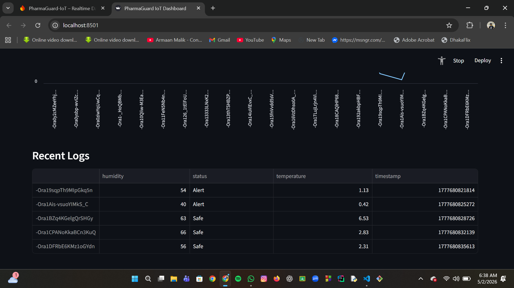

# 💊 PharmaGuard AI: IoT-Powered Cold Chain & Security Tracker

## 🚀 [Live Dashboard Demo](https://pharmaguard-ai-njdn.onrender.com)
*(Note: The live link might take 30-40 seconds to load if it's been inactive.)*

**PharmaGuard AI** is a real-time IoT solution designed for monitoring the pharmaceutical cold chain.

---

## 📸 Project Showcase

### 1. Real-time Metrics & Temperature Trend
  
*(Current Temperature, Humidity, and Trend Line Chart)*

### 2. Full Dashboard View
  

### 3. ML Prediction — Live Terminal Output


### 📊 Dashboard Visuals
|Dashbord Overview|| Live Trends | Data Log History |
|---|---|
| (dashboard_Newview2.png) |  |

---

## 🌟 Key Features
* **Live Dashboard:** Interactive visualization of temperature, humidity, and physical security.
* **Tamper Detection:** Real-time monitoring of "Lid Status".
* **Impact Sensing:** Shock force (G-force) monitoring.
* **Intelligent Alerts:** Automated warnings when conditions breach safety limits (2°C - 8°C).

## ⚙️ Technical Setup
1. **Installation:**
   ```bash
   python -m pip install -r requirements.txt
2.   ​Execution: - Start monitor: python main.py
​Launch dashboard: python -m streamlit run dashboard.py