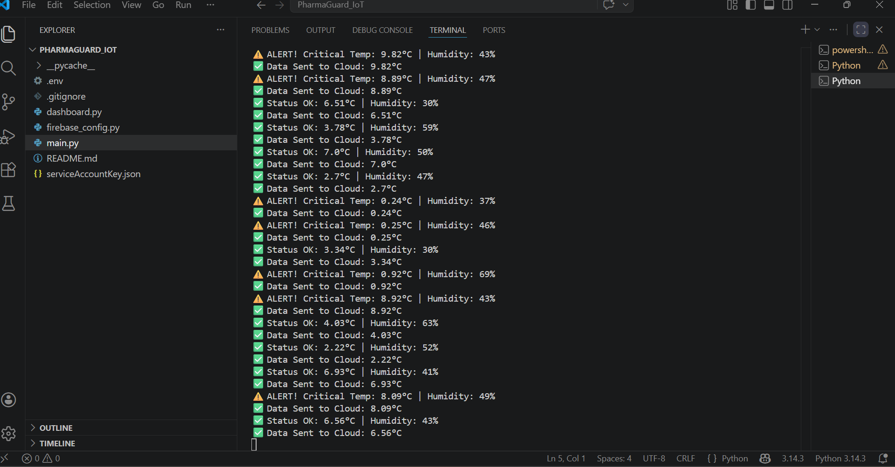

# 💊 PharmaGuard AI: ML-Powered Cold Chain & Security Tracker.

**PharmaGuard** is a real-time IoT solution designed for monitoring the pharmaceutical cold chain, ensuring sensitive items like vaccines are stored safely.

## 🚀 Key Features
* **Live Dashboard**: Interactive visualization of temperature and humidity trends.
* **Real-time Synchronization**: Instant data updates to Firebase Realtime Database.
* **Intelligent Alerts**: Automated warnings when environmental conditions breach safety limits.

## 📸 Project Showcase

Here are the live previews of the **PharmaGuard IoT Dashboard**:

### 1. Real-time Metrics & Temperature Trend
This view highlights the current environmental parameters and the temperature variation over time.

  
*(Shows Current Temperature, Humidity, and the Trend Line Chart)*

### 2. Full Dashboard View (Including Logic & Controls)
This view provides a comprehensive look at the entire dashboard, ensuring all controls are visible.

  
*(A complete look at the Real-time Monitor interface)*

### Data Logs & Alert Status
  
*Detailed logs showing system-generated alerts for critical temperatures.*

## 🚀 Recent Updates (May 3, 2026)
- **Real-time Monitoring**: Integrated Python script to push sensor data to Firebase.
- **Alert Mechanism**: Implemented logic to flag abnormal temperatures as "Alert".
- **Visual Dashboard**: Developed a Streamlit dashboard to monitor live trends.
### 🤖 ML Prediction — Live Terminal Output
The following screenshot shows the ML model predicting the next temperature in real-time alongside live sensor data:

### 📊 Dashboard Visuals
| Dashboard Overview | Live Trends | Data Log History |
|---|---|---|
|  |  |  |

### 🔄 Seamless Data Persistence & Flow
- **Historical Data Recovery**: The system automatically retrieves and displays data from previous sessions (e.g., historical logs from May 2, 2026).
- **End-to-End Sync**: Demonstrated a perfect real-time data loop from the Python simulator (`main.py`) to Firebase Cloud and finally to the Live Dashboard.

## 📊 Logic & Safety Standards
To maintain medicine efficacy, the system follows these pharmaceutical standards:

* **Status OK**: Temperature is between **2.0°C and 8.0°C**.
* **ALERT**: Temperature is **< 2.0°C** or **> 8.0°C**.

## ⚙️ Technical Setup
1. **Dependencies**: Requires `firebase-admin`, `streamlit`, and `pandas`.  
   *(Use `py -m pip` if the standard pip command is not recognized)*.
1. **Execution**: 
   - Start the monitor: `python main.py`
   - Launch dashboard: `py -m streamlit run dashboard.py`