# 💊 PharmaGuard AI: IoT-Powered Cold Chain Monitor

**Real-time Pharmaceutical Cold Chain Monitoring with AI-Powered Insights**

[](https://pharmaguard-ai-njdn.onrender.com)

---

## 🚀 Overview

**PharmaGuard AI** is an intelligent IoT-based solution designed for real-time monitoring of pharmaceutical cold chain shipments and storage. It tracks critical environmental parameters and provides actionable AI-driven insights to ensure medicine quality and regulatory compliance.

---

## ✨ Key Features

- **Real-time Monitoring**: Temperature, Humidity, Lid Status & Shock/G-force
- **AI-Powered Predictions**: Machine Learning model predicts traffic conditions and potential risks
- **Intelligent AI Agent**: Provides contextual advice based on current conditions
- **Live Dashboard**: Beautiful, responsive Streamlit dashboard with trend visualization
- **Tamper Detection**: Real-time lid open/close monitoring
- **Data Logging**: Complete activity history with Firebase integration
- **Alert System**: Automatic warnings when parameters go beyond safe thresholds (2°C - 8°C)

---

## 📸 Project Showcase

### Live Dashboard
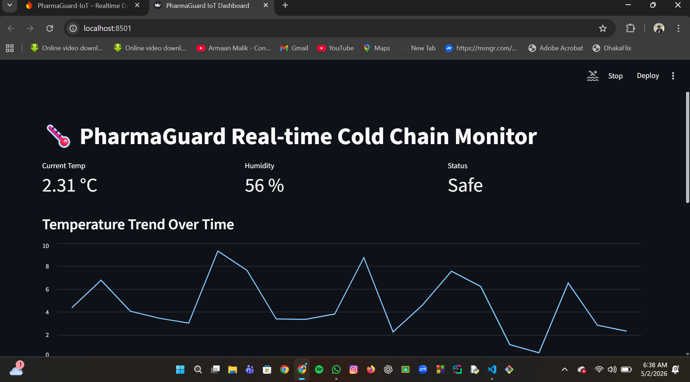

### Trends & Analytics
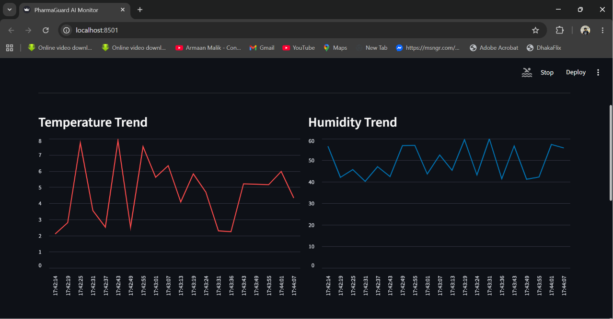

### Activity Logs
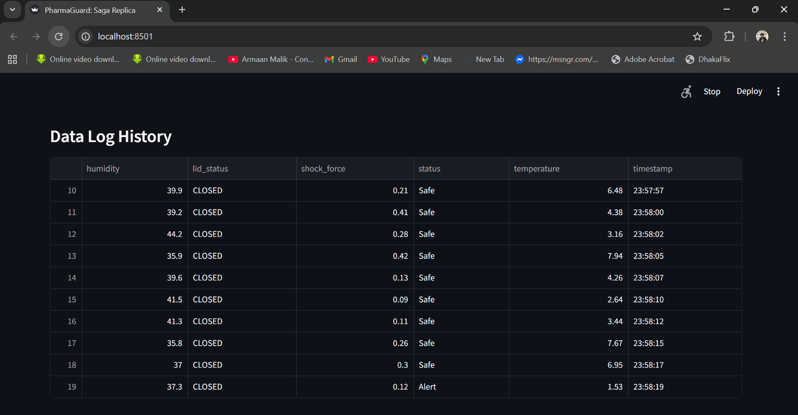

### Terminal Output with AI Insights
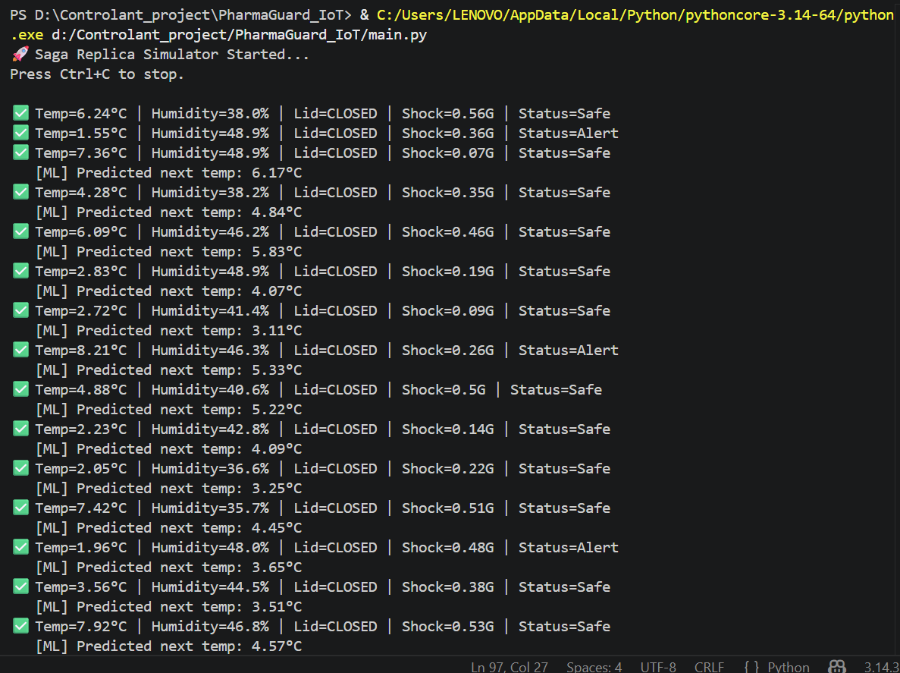

### 📊 Dashboard Visuals
|Dashboard Overview|| Live Trends | Data Log History |
|---|---|---|
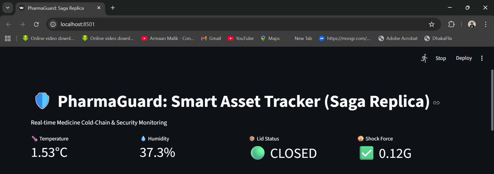  |  |

### 🚦 Real-Time Traffic & Smart Alert Optimization
PharmaGuard uses the TomTom Traffic API to adaptively optimize transit safety based on live Dhaka traffic conditions.

| Traffic State | System Logs & AI Agent Recommendations |
|---|---|
| **Smooth** | 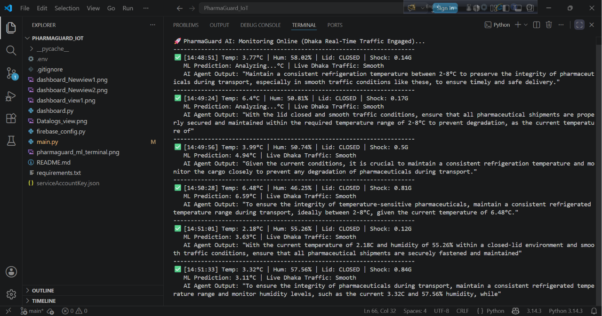 |
| **Moderate Jam** | 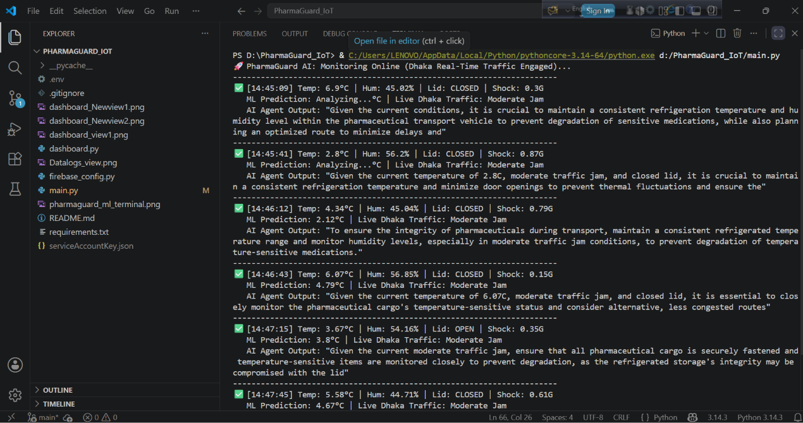 |
| **Heavy Traffic** | 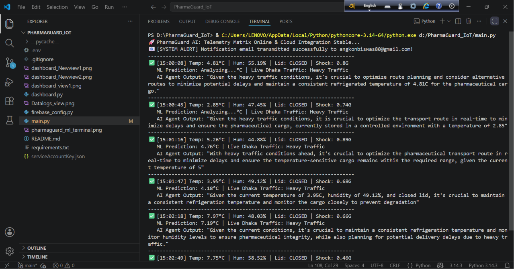 |

### 📧 Automated Notification System
When the system encounters critical routing gridlocks (`Heavy Traffic`) or unauthorized access (`Lid: OPEN`), it immediately dispatches dynamic HTML alerts to stakeholders.

<p align="center">
  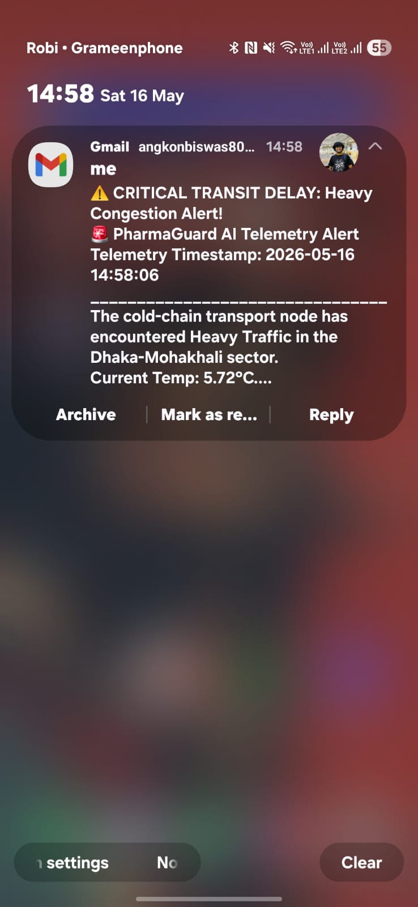
</p>

### 📧 Automated Notification System
PharmaGuard instantly dispatches professional HTML alerts when critical operational exceptions occur (e.g., severe gridlocks or unauthorized container access).

| Alert Type | Mobile Push Notification (Gmail) | System Telemetry Logs |
|---|---|---|
| **Security Breach (`Lid: OPEN`)** | 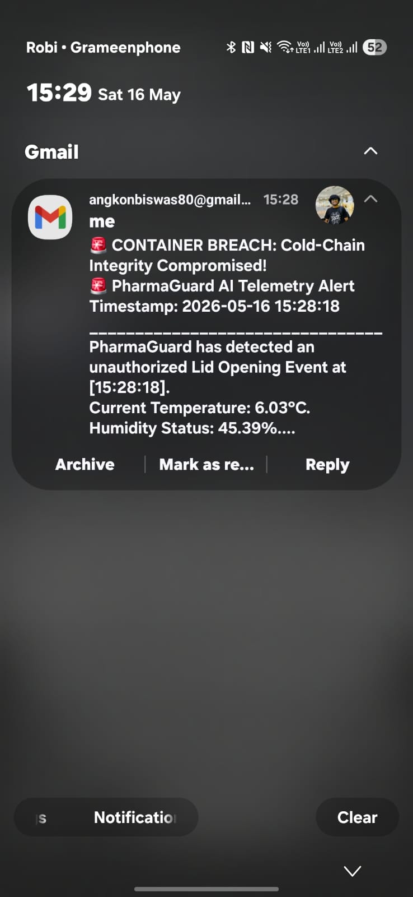 | 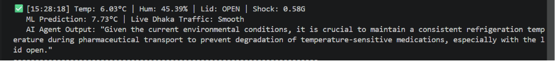 |

### 🚨 Automated Intelligence & Bio-Shield Notification System

PharmaGuard instantly dispatches professional, context-aware HTML alerts when critical operational anomalies occur (e.g., severe transit gridlocks or unauthorized container exposure). 

Aligned with **Controlant** industry protocols, the system evaluates secondary risk multipliers—combining atmospheric exposure with thermal kinetics to predict immediate pathogen threats.

#### 1. Edge Telemetry Log (Terminal)
The terminal captures the exact live timestamp when the container lid is compromised (`Lid: OPEN`), records the current temperature, and invokes the **Groq Llama-3** agent to output an immediate bio-safety directive.
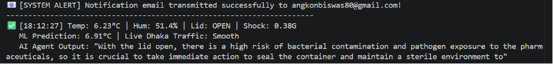

#### 2. Mobile Push Notification (Gmail)
The system fires an automated SMTP alert directly to stakeholders. If the temperature exceeds the safe threshold during exposure, it dynamically updates the subject line to a high-priority bio-hazard classification.
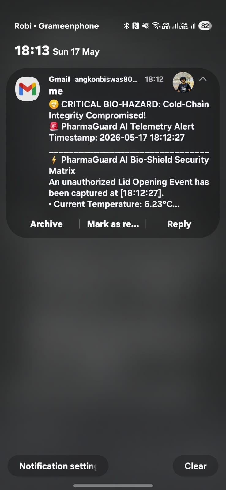

#### 3. Deep Bio-Hazard Inbox Report (HTML Payload)
Inside the inbox, a fully rendered, responsive HTML report is delivered. It embeds the dynamic microbial risk evaluation, real-time telemetry metrics, and explicit Llama-3 optimization directives for quarantine procedures.
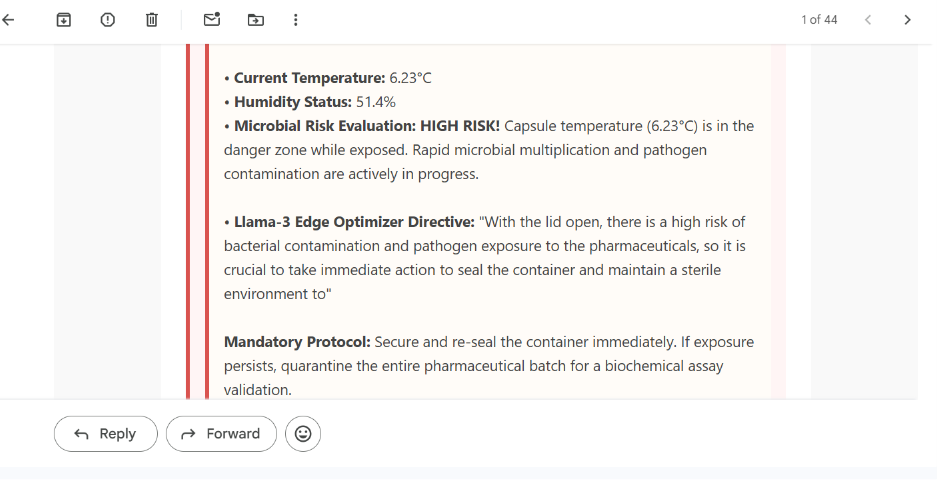

## 🛠️ Tech Stack

- **Backend**: Python
- **TomTomLiveTrafficAPI**
- **Machine Learning**: Scikit-learn (Linear Regression + Classification)
- **Dashboard**: Streamlit
- **Database**: Firebase (Firestore)
- **Visualization**: Plotly
- **Deployment**: Render
- GorqLlama-3Bio-Shield-Agent
---

## ⚙️ Installation & Setup

```bash
# 1. Clone the repository
git clone https://github.com/angkonbiswas80-del/PharmaGuard-AI.git
cd PharmaGuard-AI

# 2. Create virtual environment (Recommended)
python -m venv venv
venv\Scripts\activate    # Windows
# source venv/bin/activate  # Linux/Mac

# 3. Install dependencies
pip install -r requirements.txt

# 4. Run the monitor
python main.py

# 5. Run the dashboard (in new terminal)
streamlit run dashboard.py
